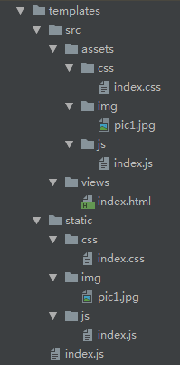

#### 脚手架实现过程

1. 创建一个项目目录pages-cli

2. 创建package.json

   ```js
   yarn init
   ```

3. package.json中添加bin字段，指定cli应用的入口文件cli.js

   ```js
   "bin": "bin/page-cli.js",
   ```

4. 根目录下添加bin文件夹新建一个pages-cli.js文件

5. 安装我们要用到的依赖

   - 安装inquirer模块实现询问交互yarn add inquirer
   - 安装ejs模块实现通过模板引擎渲染对应的文件yarn add ejs

6. 在根目录下新建模板文件templates文件夹，把我们需要的模板创建在里面，结构如下

   

7. 编写page-cli.js文件

   - 使用inquirer实现询问交互
   - 用户输入之后获取到数据操作templates
   - 使用ejs渲染模板
   - 渲染后的文件写入新项目工作目录

8. yarn link到全局

9. 测试cli是否成功

   - 新建一个文件夹
   - 根目录下执行pages-cli
   - 执行成功目录生成

10. 可以使用yarn publish把我们的pagea-cli发布到npm上

[具体代码查看pages-cli文件](https://gitee.com/nxyn/fed-e-task-02-01/edit/master/code/pages-cli)